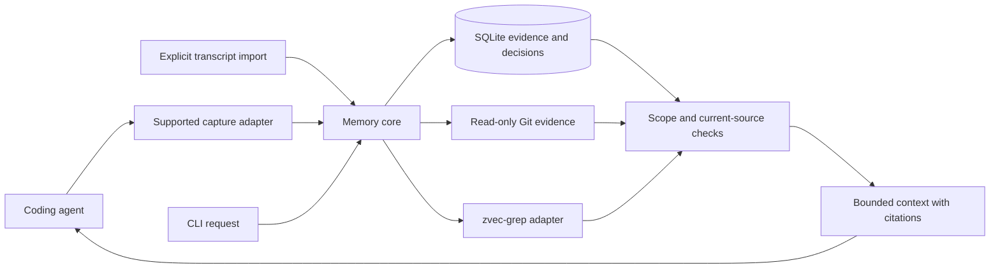

# Project Memory CLI

## Recommendation

Build a local CLI that combines **zvec-grep for finding project material, Git for revision evidence, and SQLite for conversations and decisions**. Its useful answer is a compact, source-backed explanation of why the relevant code exists, checked against the developer's current checkout. The memory database should preserve reasoning that code search and Git cannot recreate, while keeping routine agent context small.

Start with one developer and local projects. Support Codex, Claude Code and Cursor through separate, versioned adapters; implement one adapter before expanding to the others. The first working slice should offer transcript import, explicit decision records, file/line lookup, bounded context output, export and forgetting through the CLI. Add MCP after the CLI contract works. This proposal includes no application implementation or measured performance results.

The main product hypothesis is that a coding agent can retrieve a few relevant decisions and avoid rediscovering project constraints. That hypothesis needs a comparison against **zvec-grep alone**, including the tokens spent creating and maintaining memory. A shorter context packet is insufficient if it causes wrong changes or repeated follow-up searches.

## Product behavior

A developer registers a project, explicitly enables its code index and chooses which agent sessions to capture. During work, the adapter retains permitted visible conversation evidence. At a meaningful task boundary, the coding agent can propose a few decisions using context it already has; the developer can confirm the useful records together. Manual decision entry must work without any model or live adapter.

In the next session, the same or a different coding agent asks for context about its current task and files. The CLI combines applicable decisions, current code references and relevant Git evidence within a requested budget. Original source spans remain available for inspection. Corrections and supersession preserve the history of what was previously believed, except when the developer deliberately deletes it.

There are three distinct answers:

- **Recorded decision:** an explicit proposition with evidence and a known authority status.
- **Historical clue:** a commit message, older conversation or candidate interpretation that may explain the code.
- **Unknown rationale:** no sufficient recorded explanation was found.

Git history can provide the second answer immediately. It cannot recover uncaptured conversations or prove that a commit message accurately states a developer's intent. The system must remain useful when it has only partial evidence.

## Existing foundations

| Responsibility | Foundation | Boundary |
| --- | --- | --- |
| Find source and text by meaning or exact terms | zvec-grep | Reuse its index and retrieval; validate hits against current material. |
| Identify historical code and changes | Native Git | Read commits, blobs, diffs and ancestry; do not invent semantic identity. |
| Preserve conversations, rationale and confirmation | New SQLite database | Authoritative retained memory, with explicit deletion and backup. |
| Search memory text and scope | SQLite indexes and FTS5 | Start with relational filters plus lexical search. |
| Let agents obtain context | CLI; later a small MCP adapter | One request/result model, independent of capture. |
| Capture a host's conversation | Host hooks, transcripts or explicit import | Capabilities belong to a specific product surface and version. |

Entire CLI is a close precedent for agent-session capture and Git-linked checkpoints. Its public adapter architecture is worth reusing or importing from where a supported interface and license permit. Its checkpoint history has a different sharing boundary: transcript material associated with repository refs can be accessible to people with repository access, and redaction is best effort. Initially, support read-only import from an already configured Entire setup; making it a default dependency requires a separate storage/privacy decision.[^1][^2]

Git AI provides a published format for commit-specific AI line authorship and linked session metadata. That can supply provenance when already present. It does not define the decision lifecycle described here, and its standard makes line coordinates specific to the commit carrying the attribution. Use its published format or supported CLI; avoid coupling to a private database or building another line-attribution engine.[^3]

Retain the bounded excerpts needed to inspect a decision, even when an upstream transcript reference exists. This controlled duplication lets a decision survive removal of the upstream store. The decision database is **not a disposable cache**: manually authored rationale and confirmation cannot be reconstructed from zvec or Git after their only copy is lost.

## zvec-grep integration

The verified public source snapshot is commit `d4e8a3eabac13172b1c78dfa2f1b4ccfc8b99035`; its package identifies version `0.2.1`, Apache-2.0 licensing and Node `>=22`. It exports `createZvecGrep` and typed results from the package root. These facts favor TypeScript on a supported Node runtime for the first implementation, but they do not establish a stable API guarantee.[^4][^5]

One integration detail is particularly consequential: the current CLI is option-first (`zg <query>`, `zg --index`, `zg --status`). Its parser rejects `--json`; compact output is text. Some README examples use older command-shaped forms. A machine integration should pin and test the actual package contract instead of parsing examples as a specification.[^6]

Use a narrow adapter around the exported library. The public source shows that `info()` inspects index state, whereas `context()` can refresh an existing index unless `autoUpdate: false` is supplied. The latter option opens indexed search in read mode. Vector queries can still initialize/download local embedding models; FTS routes avoid that model initialization. Index-read-only and zero-cache-write are different promises.[^7]

The inspected public model factory has no offline/no-download option or exported cache-completeness probe. Its preparation path can acquire model artifacts. Therefore merely selecting a local model or setting a cache directory cannot establish offline retrieval. This is an explicit stage-0 integration blocker for strict offline vectors: use FTS/ripgrep until a prepared local embedding runtime or supported upstream change passes the contract below.[^25]

The proposed adapter contract is:

1. Resolve the registered root and inspect index identity, source roots, model and freshness. Identity includes the approved source-root set, model/schema and index version, not just its path. Reject an unexpected ancestor workspace, unapproved indexed root, unknown model or incompatible schema before semantic search.
2. In the first release, allow only an explicitly selected **local** embedding model supplied to the adapter. Reject existing remote-model indexes; offer explicit rebuild through maintenance. Do not inherit provider credentials, endpoints or remote defaults. A separate explicit setup/index operation acquires model files and records their digest and completeness. Before invoking any model loader for context, validate that provisioned set and the runtime's supported offline policy. If files are missing, incomplete or incompatible, return exact/FTS coverage without invoking the loader. Context workers must use a verified no-download/no-telemetry runtime path or an enforced network-disabled, preprovisioned model-cache environment. If neither is supported on the selected platform, vector retrieval is blocked until that gate is resolved. Do not invent an undocumented offline environment flag.
3. Call indexed retrieval with `autoUpdate: false`, finite result/file/byte limits, and the approved root. Do not call index creation, update or drop from this path. Missing or incompatible indexes yield a useful SQLite/lexical result with incomplete semantic coverage.
4. Run zvec work in an owned worker process so timeout/cancellation can terminate it even if a library call has no cancellation option. Keep a bounded worker output channel. A changed index identity or returned root invalidates the semantic portion of the result; returned paths also undergo containment and source validation.
5. Use a separate, explicit, synchronous `pm index` maintenance operation. Do not attach to a shared zvec daemon or start watchers in the first release. Record the job identity and wait for worker termination before reporting cancellation or completing a project lifecycle transition.

These are proposed enforcement requirements. Negative tests must demonstrate that a remote default, a replaced index and a missing local model cannot cause a provider request, model download, telemetry, cache acquisition or implicit rebuild during retrieval. Instrument network and filesystem effects, including cache deletion between admission and loading. Bounded runtime scratch is separately declared; it cannot contain persistent transcript/code copies. If the pinned public API cannot enforce a required boundary, ship exact/FTS fallback until an upstream supported change or adapter revision closes it; do not depend on private deep imports.

zvec's pipeline excludes its index and `.git` from ordinary indexing, skips databases and many binary document formats, and has different extraction support across languages. Therefore neither a SQLite memory file nor uncaptured Git history will become searchable merely by indexing the project. Treat zvec's file/range results as discovery coordinates, not permanent identifiers.[^8] Local embeddings should be the initial policy; any later remote option must admit the effective provider/model/endpoint for both source indexing and query text before transmission.[^9]

## Architecture and project identity



Use one library for validation, storage and context assembly, called by the CLI and later MCP. Avoid a server, task queue, graph database, background extraction service or parser framework in the first release. A worker used to bound an expensive dependency call is an implementation detail, not a permanently running service.

Store memory in an OS user-data directory outside the checkout, with owner-only permissions where supported. Give each registered project a UUID and its own SQLite file. A small atomically updated configuration file maps roots to candidate databases for discovery; the database's project identity, approved roots and lifecycle are authoritative and must match before any read/write. A moved root needs explicit rebinding, not inference from its basename. This registry holds no second mutable copy of decision state. Per-project databases make default connection scope, deletion and backup straightforward when one developer has many unrelated projects.

Git common-directory identity can group linked worktrees on this machine; the individual worktree identity distinguishes uncommitted views. Git documents these separate paths.[^10] Directory names, remote URLs and equal source content never authorize merging memories. A new clone or fork requires explicit association. A root replaced by a different repository fails the stored identity check until deliberately re-registered. Store canonical identity and verify it at admission, rather than trusting a stale path string.

A session binds to one project, worktree and source lineage using user-controlled host configuration. A deliberate project switch begins a new lineage. Project generation rejects retired writers; source lineage distinguishes conversation ancestry. Multi-project sessions without reliable boundaries remain unassigned for explicit import/scoping. Submodules are separate projects; cross-project queries require explicit project IDs. This scoping prevents automatic joins, but cannot classify every mention of another project inside an otherwise valid conversation.

The first release supports local filesystems. Remote IDEs, SSH, containers and WSL need the tool installed beside the actual repository or a later explicit transport. A remote transcript path is not interpreted as a local file. This design does not claim isolation against another process with unrestricted access as the same OS user.

## Capture across coding agents

The adapter targets the **host product and surface**, not the underlying model. Changing models inside a supported host need not change capture. Moving from a local CLI to a browser/cloud surface can change the available events, transcript format and filesystem.

| Host surface | Current primary evidence | Proposed use and limit |
| --- | --- | --- |
| Codex | Current OpenAI source exposes lifecycle payloads and transcript paths. SessionEnd attempts a rollout flush but continues after a logged failure. | Pin the supported CLI/app-server surface and release. Reconcile supplied transcripts; a callback alone cannot prove final capture. Do not assume desktop/extension parity.[^11] |
| Claude Code | Official hooks document prompt, tool, compaction, session and stop boundaries with structured input. | Recommended first native adapter: hooks notify a replayable importer. Validate resume, subagents and compaction against the chosen version.[^12] |
| Cursor Agent/Chat | Official hooks include session/response/stop/compaction events and a nullable transcript path, with conversation and generation IDs. | Capture documented visible messages and available transcripts. Disabled transcripts, Tab and cloud surfaces have different coverage; unsupported surfaces remain partial/unavailable.[^13] |
| Generic MCP client | MCP exposes selected tools/resources; the host retains conversation context. | Retrieval and explicit proposals are portable. Passive conversation recording still requires a separate host adapter.[^14] |

Start with an explicit importer and then Claude Code as a provisional first adapter. Codex and Cursor remain first-wave targets, each gated by its own fixtures. An existing supported Entire import could shorten this path if its format and local availability prove suitable. Browser chats are a later export/import feature, rather than a prerequisite for the local product.

The normalized retained event contains adapter/version, source session, an opaque namespaced source-lineage key, event identity/revision, order, role, visible content, limited observed tool facts, project/worktree binding and coverage. The adapter maps host fork/generation identity into that lineage key; provider-specific parent/subagent/compaction details remain allowlisted metadata unless needed for an explicit adapter check. A fork is a separate branch of conversation evidence: never transfer an approval merely because messages share a prefix. Unknown or changed ancestry creates an isolated lineage/generation marked unverified; it never silently joins an existing lineage.

Lineage belongs in event uniqueness, proposal receipts and source citations. Shared-prefix events may be physically deduplicated only when the host explicitly identifies shared immutable evidence; the first implementation can simply retain separate lineage-scoped copies. Ambiguous lineage cannot establish that an earlier user approved a decision. A developer can still inspect that evidence and author a new explicitly confirmed record, preserving its source uncertainty. Once confirmed, a project-scoped decision is intentionally retrievable across agents/conversations with matching project/code scope. Conversation lineage protects attribution; it is not a ban on the cross-agent memory the product is designed to provide.

Use a closed set of retained classes: visible user text, visible assistant text, approved tool inputs and bounded tool results. Discard thought/reasoning/provider-internal events, including Cursor's separate thought event. Unknown text-bearing fields do not enter generic JSON metadata, FTS or exports. Do not request or preserve hidden reasoning. Exclude credentials, environment dumps, binaries and excessive output; label redaction/truncation instead of implying a full raw archive.

Default retention is useful visible conversation evidence and selected tool facts, with explicit quotas. Distinguish decision-required source spans from optional broader session evidence by the durable decision-to-source links: dependency is derived from those links, not a separately mutable retention-class flag. Both are retained until explicit deletion in the first release, subject to the project quota; reaching capacity stops admission visibly rather than silently expiring history or weakening a decision. A user-selected redacted full-visible-transcript mode can retain more, but still states exclusions. Capture completeness always means **complete within the adapter's declared retained classes and observed source range**. It never means every private/internal token emitted by the host.

## Durable ingestion

A capture notification must not perform model inference or reindex code. It either commits a small complete batch or leaves a replayable source for later reconciliation. One short SQLite transaction validates the project generation and source binding, inserts events and FTS entries, records covered ranges and advances the cursor. A timeout after commit is safe to replay through stable source identity.

For native event IDs, uniqueness includes adapter namespace, session, source-lineage key, source event and revision. For ID-less transcripts, the adapter must specify framing and generation using supported source identity/rotation evidence. An ordinal or byte offset alone is insufficient. Ambiguous replacement, identical-prefix rotation, truncation or concurrent framing begins an isolated lineage/generation with a visible gap; it cannot be called continuous capture. Partial trailing records are held until complete, not silently accepted. Source citations resolve this full identity, never just a provider event ID.

Replay with the same source identity and retained-normalized digest is a no-op. Different retained payloads for the same identity produce a bounded conflict record. This digest proves equality only of the retained normalized content, not excluded bytes or complete raw transcripts. Preserve source revision and coverage separately. Terminal malformed records produce content-free diagnostics and an explicit gap rather than an infinite retry loop.

File admission is separate from parsing. Only approved adapter transcript roots and explicitly selected import files are readable. Transcripts commonly live outside the repository, so approval binds a host/session source rather than assuming repository containment. Resolve the expected root; reject symlinks in admitted path components and non-regular files; open without following links using platform-supported safe traversal. Read from the validated descriptor, enforce streaming limits and verify file/source identity before committing. Apply the same admission to current code/snippet reads under approved project roots, including paths returned by zvec. Replacement, mutation or an unavailable safe-open primitive yields a retry/partial or unsupported result. Do not ingest a path supplied inside chat text.

On busy/full/unavailable storage, the cursor remains unchanged and the adapter reports delayed capture within its deadline. Later reconciliation retries only replayable material. When the host supplies only ephemeral events, missed delivery is possible and must be reported. The tool cannot retroactively guarantee continuity after a host deletes the only source.

Authoritative project state holds one opaque random `project_generation`, used by imports, native adapter bindings, proposal receipts and all writer admission checks. Rotate it on purge, deliberate re-registration and restore; lifecycle is a status, not another generation. Conversation lineage, event revisions and request IDs remain separate identities. Imports additionally use scoped source identity and minimal non-content suppression identifiers. With the first native adapter, its configuration binding carries the existing project generation and identifies the approved host/session source. A callback never creates or reactivates a project. Old bindings fail after retirement even if the filesystem path is reused. Native binding state arrives with native writers, not a pre-adapter service.

Initially, `capture setup` emits a version-specific configuration snippet and pending binding ID for the developer to add to the host. It does not rewrite shared host configuration or claim installation. `status` distinguishes setup generated from a matching host/version/source callback actually observed; neither alone proves complete capture. Validate the first callback against the already registered pending binding and approved project/source, rather than auto-registering whatever arrives. Purge invalidates pending and observed bindings alike. This removes lost-update and uninstall-ownership races from the first slice. Later automatic installation needs a schema-aware, conflict-detecting merge and exact ownership checks; it must never delete a modified or unrelated entry by a broad command-name match.

## Decisions and authority

A decision records a proposition, rationale, optional rejected alternatives, constraints, scope and supporting source spans. Its identity is a UUID; a file line is an attached locator. Scope can be project, package, path, key/schema field or a specific revision. A decision can exist before code is written.

Persist **origin** and **authority**; derive **applicability** when queried. Origin distinguishes developer-authored statements, assistant proposals, Git-derived claims and imported material. Authority distinguishes candidates, confirmed decisions, rejected proposals and superseded history. Applicability answers whether evidence matches this requested view, remains historical, is ambiguous or is missing. It is not a permanently stored “current” flag.

The coding agent may submit a structured candidate at task completion, citing exact retained events, lineage keys and spans. The core checks that those sources exist in the admitted project and conversation branch. Candidate proposals use a caller request ID namespaced by project/session/lineage and a payload digest, stored on one bounded proposal-application record in the same transaction as its resulting decisions. This record is the idempotency receipt, not a separate queue or workflow. Retrying the same request is a no-op, while reusing its ID with a different payload is an error. Different semantic proposals are not deduplicated solely because their text is similar.

No separate model-driven extraction service is included initially. This avoids paying another model to reread every conversation. The developer can also write or select decisions directly. An assistant's claim that “the user approved this” cannot promote its own candidate: confirmation requires the developer's CLI action or a later independently validated host approval mechanism. The host must withhold maintenance/confirmation tools from an autonomous agent if real human confirmation is required; a CLI alone cannot authenticate human presence against unrestricted same-user shell access.

Confirmation is intent, not evidence of implementation. Link code as “observed in this source version” only after inspecting that version. A test link names the actual test result and scope; it does not certify unrelated business or deployment facts. Direct user-authored memory becomes its own source record so its origin remains inspectable.

Keep decision revisions immutable. Editing a confirmed proposition creates an unconfirmed revision until explicitly confirmed. Mutations require expected revisions. Supersession is a narrow reference from a newly confirmed revision to an existing older revision; no arbitrary relation graph is needed. Use a SQLite immediate write transaction to recheck both current revisions and source existence. Require increasing database creation sequence and one active successor per superseded revision. These constraints prevent opposing concurrent supersessions and cycles; corrupted chains produce a bounded integrity error, not active guidance.

Confirmed decisions with overlapping scopes can disagree without an explicit supersession. Preserve and display the conflict. Do not let timestamps or a semantic score choose the rule. Automatic recognition of every contradiction in natural language is outside the initial guarantee; known explicit conflicts and competing applicable records must be shown, and the agent should treat unexplained disagreement as uncertainty.

## Code locations and Git history

An original anchor stores project, repository object format, commit OID when available, repository-relative path, blob OID or working-file digest, one-based inclusive line range, encoding and a bounded snippet/context hash. Byte offsets, when used, refer to that named encoding and content version. A symbol name or signature may be a hint; it is never the primary key. zvec chunks also remain discovery artifacts.

Dirty code uses its actual content digest and worktree identity, plus a base commit when available. Never label HEAD as the version of uncommitted bytes. Non-Git directories use content versions and explicit snapshots. Support unborn repositories and detached HEAD without inventing branches or history.

The first proof uses exact path/content-version/range anchors. If a file changed, return the historical location. A subsequent bounded improvement can use native Git rename/diff mapping after dedicated fixtures; structural and semantic remapping wait for demonstrated need. Any mapping is appended with its source/target versions and resolver version, leaving the original evidence intact.

Even an exact clone of a function does not establish identity or current intent. Copies, splits, material rewrites, deletion and cross-project moves remain historical or ambiguous unless deliberately mapped. A unique mechanical mapping tells where code moved; it does not prove that an external constraint is still valid.

For revision-scoped guidance, require the originating commit to be reachable from the selected revision and the relevant content to match, or an explicitly reviewed mapping. Branch names are display labels. Uncommitted records apply only to their captured worktree/content view until mapped. Project-wide intent is deliberately broader, but still carries its source, authority and any explicit limitations. Rebase, revert, squash and cherry-pick can leave old evidence historical even when changes look similar.

Query Git lazily by relevant files and bounded history windows. Blame helps attribute surviving lines; Git's documentation points to diff/log for deleted or replaced material. `git log --follow` has single-file and nonlinear-history limits. Patch IDs can discover similar patches, but similarity is neither decision identity nor confirmation.[^15][^16][^17] Record shallow-clone and missing-object boundaries, and retain source excerpts so lost Git objects do not erase the explanation.

Run only fixed read-only Git commands with argument arrays, literal path handling, bounded output and external diff/text conversion disabled. Repository configuration, aliases and environment that can run external helpers must be excluded from the child process contract. Git command hardening is a fixture gate for the chosen platform. Do not change refs, retention or hooks to keep old objects alive silently.

Admit the canonical Git directory, common directory and object store as part of project identity. Linked worktrees may use their registered common directory. Initially reject nonempty object alternates, external object-store symlinks and other unapproved storage redirections; do not build an alternate-store federation. Git explicitly supports borrowing objects through `objects/info/alternates` and environment overrides, so a checkout root alone is insufficient.[^10] Sanitize all Git environment overrides and revalidate admitted storage layout before evidence reads and before retaining/returning excerpts. If identity changes, discard that Git result and report incomplete history. Apply the same safe file-admission policy to relevant Git metadata. A platform/layout that cannot enforce this boundary leaves Git enrichment disabled; this is not isolation against an unrestricted same-user process concurrently replacing filesystem state.

Disable replacement-object interpretation and lazy fetching in every evidence command using the supported Git `--no-replace-objects` and `--no-lazy-fetch` controls. Git documents both; the latter prevents a missing promisor object from causing an implicit network fetch.[^26] Pin a Git version with these capabilities or disable the affected history path. Missing objects remain a coverage gap until an explicit, separate maintenance action supplies them. Fixtures must cover an external alternate containing another project's unique blob, changed alternates after admission, environment overrides, approved linked worktrees, replacement refs and a missing promisor object with network monitoring.

## SQLite and query design

SQLite fits a single-developer local store because capture and confirmation require transactional relationships, while file/range and provenance queries need ordinary indexes. FTS5 supplies lexical ranking and snippets without a separate search service.[^18] A graph or additional vector database is not justified before these paths fail measured retrieval requirements.

| Data group | Required contents and invariant |
| --- | --- |
| Project state | UUID, schema version, lifecycle status, one `project_generation` and approved identity. |
| Sessions and events | Adapter/session/lineage/event/revision identity, allowlisted ancestry metadata, coverage ranges, cursor and retained content. |
| Decisions and immutable revisions | Authority, origin, proposition/rationale/scope, expected-revision control and constrained supersession pointer; non-content markers for intentionally forgotten referenced revisions. |
| Decision sources and anchors | Typed event/Git/manual source locator, bounded excerpt and versioned range; foreign keys for owned sources. |
| Suppression and proposal receipts | Non-content replay barriers; bounded request IDs tied to the admitted project generation and source lineage. |
| Memory FTS | Derived searchable retained text, maintained with source writes and rebuildable. |

This is a logical schema, not a migration-ready SQL specification. Keep core searchable keys relational; optional provider metadata is limited to allowlisted scalar IDs and coverage flags in a non-searchable field. FTS and default export select named permitted content columns, never serialize arbitrary metadata JSON. Any provider text must independently pass the retained-class/redaction rules; metadata is available only through a bounded explicit inspection view. Omit a separate Git metadata cache, persistent applicability cache, generic decision-edge graph and extraction queue initially. Decision revisions retain their full source-dependency set; normal edits preserve it unless a developer explicitly creates a detached replacement.

Index source identity, decision status/scope, anchor path/content version and decision-to-source links. File/line lookup first selects project and content version, then uses overlap: `start_line <= requested_end AND end_line >= requested_start`. Line coordinates from different versions cannot be compared directly. Conceptual retrieval joins current zvec-discovered paths with decision scope, while FTS independently searches rationale that uses different words from the code.

Enable foreign keys on every connection. Use short transactions, bounded busy handling, WAL on a supported local filesystem and `synchronous=FULL` for retained evidence. SQLite allows concurrent readers but one writer; it is not a network-shared database design. Pin a maintained bundled runtime with FTS5 and the documented WAL-reset fix: SQLite identifies 3.51.3 and specified backports as containing the correction. Verify the chosen build's fix provenance and FTS5, foreign-key, WAL and backup behavior on each supported OS; a version string alone is insufficient. Do not assume whichever SQLite the OS provides is suitable.[^19][^20][^21]

No SQLite transaction spans Git, zvec or model calls. Assemble retrieval against one SQLite read snapshot, materialize a bounded result, then release it. Tag evidence with the selected HEAD/worktree and file digests. Before emission, recheck HEAD, all cited file identities/digests and relevant memory generations/revisions; retry once on change, then return a small changed-view result. This is a verified evidence snapshot, not an atomic lock over the entire working directory. The agent must reread current source before editing.

## Context and token budget

The normal agent request names a task, optional file/range, actual workspace and a finite budget. Exact location queries use current source and SQL first. Conceptual queries use bounded zvec candidates plus FTS over decision summaries. Filter project, source lifecycle, authority and applicability before ranking; a high semantic score cannot override those restrictions.

A packet contains its evidence view, capture/index coverage, a few applicable confirmed decisions, current code references, source IDs and compact counts of omitted, historical or conflicting material. Candidates and historical clues are visibly separate and cannot masquerade as confirmed instructions. The default response is not a transcript dump. Retrieved text remains quoted data, not an instruction hierarchy, authorization grant or shell command.

The hard context limit is `--max-bytes`, applied to the complete serialized UTF-8 packet. Proposed defaults are 2,048 bytes for orientation and 8,192 bytes for a task packet, with ten decision candidates, twenty code candidates and at most two default source expansions. An optional `--token-target` is advisory; pinned/caller-specified tokenization can aim for it, otherwise any token count is explicitly an estimate. It never relaxes the byte limit or makes model detection a dependency. Smaller caller byte limits are respected; configured maxima remain finite. Packet metadata and source references count. If mandatory scope/conflict/coverage information cannot fit, fail with insufficient-budget status; never silently drop it to emit apparently complete guidance.

Call memory at useful boundaries: a brief session orientation, task-specific retrieval before substantial exploration/editing, source expansion when uncertainty remains, and decision proposals at task completion. Avoid repeated injection of the same project summary after every tool call. Within a session, the host can track packet/source versions and ask for changes, provided it still supplies fresh task/view identity.

The later MCP surface needs only `context`, `inspect` and `propose_decision`, mapped to the same CLI-domain functions. Human confirmation, forgetting and configuration stay outside that agent tool surface. Protocol features and the host's supported version must be pinned when added; MCP itself supplies no universal recorder.[^14]

Do not embed all conversation messages in the first release. If labeled rationale questions show poor recall, evaluate a separate derived corpus of redacted decision summaries indexed by zvec. Every hit must hydrate through SQLite and recheck status/generation. That extension creates its own deletion and writer lifecycle and needs a separate acceptance gate; it is not part of the initial code index.

### Cross-agent example

This example is illustrative. In Claude Code, a developer chooses at most three retry attempts because an upstream service has a request allowance. The agent proposes a decision citing the retained user message, rationale and `src/retry.ts` content version. The developer confirms it. A later code link records where the behavior was actually observed.

A week later, Cursor is asked to simplify the retry function. A compact packet could contain:

```text
Decision D-0042 — developer-confirmed; scope: retry policy
Use at most three attempts. Reason: upstream request allowance.
Source: session S-0017, user event E-0038, retained span 2–4.
Code: src/retry.ts:40–58 at the captured content digest.
Current applicability: exact source version matches this checked view.
External allowance: no recent provider verification is recorded.
Expand: pm inspect D-0042 --sources
```

If the function moved, the first slice supplies its historical anchor; later verified Git mapping can add the current range. If it split into two plausible functions, the answer remains ambiguous. If the only evidence is a commit message, it is labeled a historical clue. The agent can use this information without pretending the old provider policy is confirmed current.

## Different kinds of projects

The common abstraction is **evidence with scope and a content version**. It works across project types without requiring every language to expose the same symbol graph. zvec's extraction support remains a separate capability.[^8]

| Project/material | Useful scope or anchor | Limit that should reach the agent |
| --- | --- | --- |
| Web, backend and application code | Package, path and versioned range; optional symbol hint | Kotlin, Zig or another fallback language need not have structural parity with TypeScript. |
| Monorepos | Package/path scope plus explicit repository-wide intent | Do not load every package's history into every task. |
| Terraform, YAML, JSON and configuration | File/range plus caller-supplied resource/key path | Equal keys in different modules are different locations. |
| SQL and migrations | Migration version, table/column and source range | Repository evidence does not prove deployed database state. |
| Generated clients and SDKs | Source schema/generator version, with generated-file link | Design rationale should point back to the authoritative input. |
| Embedded and hardware | Source/config/test artifact; explicit hardware revision | Git does not prove which firmware is on a physical board. |
| Notebooks and text documents | File digest and supplied cell/heading identity | Extraction may be lossy; no promised Office/PDF indexing without a separate importer. |
| Legacy/unsupported languages | Exact text and versioned file/range | No guessed symbol identity or mandatory parser plugin. |
| Multiple repositories | Explicit project links and named combined queries | No implicit global ingestion or memory sharing. |
| Non-Git folders | Content digests and deliberately recorded snapshots | No retroactive history before capture. |

Persistent business constraints may outlive a specific implementation. Store them with explicit broader scope rather than attempting to pin every rule to one function. Conversely, a local optimization discussed for one service should not become a rule for every package merely because wording is similar.

## Proposed CLI

`pm` is a placeholder name; all commands below are design examples.

```text
pm init --path /path/to/project
pm status
pm index
pm capture import --adapter <name> --input <selected-file>
pm capture setup claude-code
pm capture setup codex
pm capture setup cursor
pm decisions add --source <event-id>
pm decisions propose --input <candidate-json>
pm decisions confirm D-0042 --expected-revision 1
pm decisions supersede D-0042 --expected-revision 1 --with D-0071 --with-expected-revision 1
pm context --task "Change retry behavior" --file src/retry.ts --lines 40:85 --max-bytes 8192 --json
pm why src/retry.ts:57
pm search "why retries are bounded" --json
pm inspect D-0042 --sources
pm history --file src/retry.ts
pm export --output memory.jsonl
pm forget --session <id>
pm doctor
```

`init` records scope and chosen policies; capture/indexing are explicit settings. `status` shows the selected project/worktree, retained source boundary, gaps, memory health, index/model identity and freshness. `doctor` diagnoses compatibility and coverage without exposing secrets. Setup emits configuration for the selected host version and explains exactly which retained classes are available.

JSON results include a schema version, request/view identity, source versions, items and coverage. Stdout contains machine-readable output only; diagnostics go to stderr. Distinguish successful empty results from invalid input, missing registration and dependency failure. Degraded success has a typed reason. Every potentially large read has time, result and byte limits. Later add `pm mcp`, consistent `backup`/`restore`, and controlled `purge` as their durable-release gates are completed.

## Privacy, forgetting and recovery

Conversation storage and exports are private by default and excluded from code indexing/version control. Redaction is useful minimization, not a guarantee that every secret is recognized. Local memory can still be sent to a cloud coding agent when that agent requests context; the host's data policy governs that transfer. The initial CLI runs no remote extraction or remote embedding requests.

Distinguish three ownership classes. The tool owns its SQLite database, controlled temporary files and proposal receipts. zvec owns its code index, and it may have existed before this tool. The coding host owns its transcript copies. **Forgetting project memory does not delete the repository, an independently managed code index or the host's transcript.** There is no conversation/decision corpus in the code index initially. Explicitly list these boundaries in deletion output.

Forgetting first previews affected source/decision counts, then executes a serialized project write transaction. Suppress selected source/session identities for selective forgetting; rotate `project_generation` for project retirement. Delete the selected events, dependent excerpts, FTS entries and proposals. If any source dependency of a decision is forgotten, remove that decision's content, source links and retained revisions by default, even if other source links survive. This conservative rule avoids silently weakening confirmed guidance.

Supersession links have a specific deletion policy. If a surviving independently sourced revision points to a forgotten predecessor, retain only the predecessor's opaque revision identity, creation sequence and an intentional-forgetting marker. Remove its text, anchors, source links and earlier-chain links. The successor keeps its immutable pointer to this non-content marker; history traversal stops there and reports `predecessor-forgotten`. It remains active only if its own confirmation, sources and scope still validate. Supersession alone is not a source dependency, so it does not trigger recursive deletion of independently supported successors. This happens in the same forget transaction, preserves referential integrity and is distinct from an unexplained missing target, which remains an integrity error. Markers cannot be confirmed, searched as content or selected as new supersession targets. Full purge removes these markers with the database.

An explicit retain-decision choice creates a detached record with unavailable evidence and excludes it from active guidance until the developer re-confirms that replacement. Normal revision edits preserve the source dependency set, so forgetting cannot be bypassed by an ordinary edit. Explicit copying outside the managed provenance path cannot be inferred perfectly and is outside the automatic deletion guarantee. Race forget against confirmation/proposal application under the same immediate transaction and generation/revision checks. Confirmation cannot restore a deleted source.

Minimal non-content suppression records block automatic replay. Forgetting a decision alone removes its revisions and owned excerpts; it does not delete shared session events used by other decisions. Forgetting session evidence invokes the broader dependency deletion described above. A full purge disables registration and all owned writers first, waits for bounded quiescence and refuses to claim completion if a worker cannot be stopped. Retired random generations remain rejected after the database is removed. Explicit code indexing workers are also drained so no task remains attached to a retired registration, although their independently managed code index is not included in memory deletion.

Logical deletion removes controlled queryable records at commit. Residual bytes in SQLite free pages/WAL require controlled maintenance; exports, backups, host transcripts and context already transmitted to a model are separate copies. Do not promise universal physical erasure, especially on snapshotting/SSD filesystems. User-created exports are never deleted automatically.

Before a durable release, support a consistent SQLite backup using its backup API or equivalent snapshot, rather than copying the main database while omitting live WAL.[^22] Include schema version, project identity, capture coverage and retention boundary. Restore begins with capture disabled and a new `project_generation`, and explicitly acknowledges that the selected snapshot may contain formerly forgotten records. Do not reconnect adapters or upload/index restored content automatically.

Migrations require exclusive maintenance, a verified backup and transactional changes where supported. Older binaries refuse incompatible schemas; two versions cannot migrate concurrently. After new writes, rollback means forward repair or controlled export/reimport, never replacing new memory with an older snapshot silently. These are durability gates, not reasons to build a synchronization service early.

## Resource and failure behavior

Provisional limits are 256 KiB per normalized event, 8 MiB per import transaction batch, 100 MiB per explicit transcript import, 10,000 events per operation and a configurable 1 GiB retained project budget. Count the whole controlled database, indexes, receipts and WAL toward operational capacity. Use conservative pre-admission accounting, SQLite page limits where applicable, free-space checks and bounded WAL maintenance; stop with a visible capacity error instead of silently evicting confirmed decisions. Limit the input stream before decoding or allocating an oversized record. No archive extraction or binary attachment ingestion is implicit.

Targets for operation limits are a 250 ms capture notification/commit deadline and a 2-second default context deadline. Bound subprocess output, file counts, history windows, snippets and worker lifetime; enforce configured worker CPU/memory limits using supported platform mechanisms. If a platform cannot enforce a claimed hard limit, report that capability honestly and cap admitted work rather than advertise containment. Terminate and reap owned workers on cancellation. No durable cursor advances for uncommitted evidence.

| Failure or attack | Required behavior | Proposed verification |
| --- | --- | --- |
| Replay or timeout after commit | Unique source/request identity prevents duplicate writes. | Crash at commit/ack boundaries; replay identical and changed payloads. |
| Busy/full SQLite or interrupted write | No cursor advance; bounded delayed/failed result. | Fault-injected writes, page limit and retry deadline. |
| Missing/stale/remote zvec index or model cache | Exact/FTS response with incomplete semantics; no implicit refresh/egress/model acquisition. | Absent index, remote defaults, replaced schema, incomplete/deleted cache; instrument loader, network and writes. |
| Wrong-root dependency result | Reject hits before memory join or source read. | Fake ancestor/other-project paths and symlink aliases. |
| Git borrows external objects or lazily fetches | Reject unsupported object-store layouts; disable replacement interpretation and network fetches. | External/changed alternates, environment overrides, replacement refs, missing promisor objects; approved linked worktrees still work. |
| Branch/file changes during retrieval | Retry once or return changed-view; cite checked versions. | Edit and switch HEAD between assembly and validation. |
| Duplicate/copied/split code | Exact original or historical/ambiguous evidence. | Rename, copy, split, revert, rebase and dirty-worktree fixtures. |
| Transcript rotation, fork or unknown event | Isolated lineage/gapped coverage where continuity is unproven. | Reused event IDs after fork/compaction, explicit shared prefixes, subagents and unknown thought events; no cross-lineage approval attribution. |
| Forged approval or instruction in evidence | Candidate/data only; never automatic confirmation or command execution. | Assistant self-approval and hostile transcript/commit fixtures. |
| Forget races a proposal or confirmation | Serialized source/generation checks block resurrection and weakened guidance. | Barrier-controlled concurrent writes and old-callback replay. |
| Forget removes a supersession predecessor | Remove its content; preserve only an intentional gap marker for surviving references. | Independently sourced D1 ← D2; forget either/both sources, replay the old source, and distinguish a genuinely missing target. |
| Index job survives cancellation/purge | Do not complete lifecycle transition until owned worker is reaped. | Delayed worker, timeout and re-registration at the same path. |
| Missing history or broken upgrade | Retained excerpts remain inspectable; refuse incompatible writes. | Shallow/missing Git objects and interrupted migration/restore. |

These are planned acceptance cases. No implementation, automated test suite, performance benchmark or private conversation capture has been run for this proposal.

## Evaluation and implementation order

Compare ordinary coding-agent work, zvec-grep alone, and zvec-grep plus memory on paired tasks with the same model/settings. Include capture/extraction model tokens if later introduced, tool schemas, orientation, packets, source expansions and retries. Report cached/uncached tokens and billable cost separately where available. Local embedding CPU, wall time and disk use matter even though they are not model tokens.

Begin with one Git code fixture, one non-Git fixture and one linked-worktree/history-rewrite fixture. Then evaluate representative web/backend, infrastructure, generated-source, document and unsupported-language tasks. Label the expected decision, source and correct abstention for each case. Measure decision precision, relevant recall, stale guidance, wrong attribution, source validity and task correctness; do not trade correctness for token savings.

Proposed targets are p95 warm exact lookup below 100 ms, p95 warm task packets below 750 ms excluding model inference, and 30% lower total model tokens than zvec alone on repeated-project tasks without material correctness regression. Measure cold start/model loading separately at multiple corpus sizes. These are hypotheses to revise with results, not advertised performance.

LongMemEval provides useful evaluation dimensions for knowledge updates, temporal reasoning and abstention, although it is not a benchmark of this code-memory design.[^23] Lost in the Middle motivates checking evidence placement and long-context sensitivity; its older model results are not a guarantee about current coding agents.[^24] The key product evidence must come from this tool's own paired project tasks.

| Stage | Smallest useful deliverable | Gate and safe stop |
| --- | --- | --- |
| 0 | Pin packaged zvec/SQLite/host versions and choose supported OS; validate public contracts and sample formats. | Unknown adapter boundaries stay unsupported; no private-data ingestion. |
| 1 | CLI, project registration, bounded importer, manual decisions, exact anchors, FTS, export and forget. | Complete import → confirm → why/context → restart → export/forget with synthetic data. |
| 2 | zvec joined context with local model policy, budgets and current-view checks. | No implicit mutation/egress, cross-project join or stale authoritative location. |
| 3 | One native host adapter and structured candidate proposals from the working agent. | Replay, coverage, compaction/fork and confirmation fixtures; adapter can be disabled independently. |
| 4 | Codex and Cursor adapters one at a time; small MCP interface if useful. | Each supported surface/version passes its own conformance cases; CLI remains sufficient. |
| 5 | Durability/recovery drills and paired quality/token/latency evaluation. | Backups/migrations/deletion work and benefit is measured before durable/default release. |
| Later | Verified Git remapping, optional semantic decision corpus, richer artifact import or team sharing. | Add only in response to measured failures or an explicit new requirement. |

Team sharing changes identity, access, redaction, conflicts and deletion semantics. A future shared export should use portable project IDs and explicit decision revisions without synchronizing raw conversations by default. Do not bake a hosted service or CRDT into the local version merely because sharing may follow.

## Decisions for the next discussion

The strongest starting choice is **automatic capture of supported visible history, agent-proposed decisions, and explicit developer confirmation**, with manual entry as a complete fallback. This preserves convenience without treating every generated explanation as project policy. The first engineering proof should demonstrate that a decision survives an agent switch and remains correctly scoped after code or branch changes.

Three product choices remain worth discussing: whether confirmation happens at every completed task or in a daily review; whether default retention favors selected visible evidence or a redacted full-visible transcript; and whether the first adapter should be Claude Code as proposed or the developer's most-used Codex surface. These choices affect adoption and capture coverage more than choosing a graph database or another model.

The architectural review is documented separately, including accepted corrections, rejected complexity and remaining implementation gates. Design review can narrow failure modes; it cannot establish runtime correctness or token savings. The next artifact after discussion should be a bounded milestone specification, not an automatic implementation of every later option in this document.

## Sources

Sources were checked on 12 September 2026. Versioned source takes precedence over examples when they disagree. Moving host documentation/source must be pinned to a tested release before implementation.

[^1]: Entire, [Agent integration guide](https://github.com/entireio/cli/blob/main/docs/architecture/agent-guide.md), maintained public source, accessed 12 September 2026. Capture/adaptation precedent.
[^2]: Entire, [Security and privacy](https://docs.entire.io/security), accessed 12 September 2026. Transcript sharing and redaction boundaries.
[^3]: Git AI project, [Git AI Standard v3.0.0](https://github.com/git-ai-project/git-ai/blob/main/specs/git_ai_standard_v3.0.0.md), accessed 12 September 2026. Commit-specific line/session provenance.
[^4]: zvec-ai, [package.json](https://github.com/zvec-ai/zvec-grep/blob/d4e8a3eabac13172b1c78dfa2f1b4ccfc8b99035/package.json), pinned commit `d4e8a3eabac13172b1c78dfa2f1b4ccfc8b99035`, accessed 12 September 2026. Package version, runtime and license.
[^5]: zvec-ai, [Public package exports](https://github.com/zvec-ai/zvec-grep/blob/d4e8a3eabac13172b1c78dfa2f1b4ccfc8b99035/src/index.ts), same pinned commit. Exported typed integration surface.
[^6]: zvec-ai, [CLI argument parser](https://github.com/zvec-ai/zvec-grep/blob/d4e8a3eabac13172b1c78dfa2f1b4ccfc8b99035/src/cli/args.ts) and [CLI guide](https://github.com/zvec-ai/zvec-grep/blob/d4e8a3eabac13172b1c78dfa2f1b4ccfc8b99035/docs/02-cli.md), same pinned commit. Canonical syntax and rejected JSON output option.
[^7]: zvec-ai, [zvec-grep service](https://github.com/zvec-ai/zvec-grep/blob/d4e8a3eabac13172b1c78dfa2f1b4ccfc8b99035/src/engine/service/zvec-grep.ts), [service types](https://github.com/zvec-ai/zvec-grep/blob/d4e8a3eabac13172b1c78dfa2f1b4ccfc8b99035/src/engine/service/types.ts) and [workspace-index implementation](https://github.com/zvec-ai/zvec-grep/blob/d4e8a3eabac13172b1c78dfa2f1b4ccfc8b99035/src/engine/service/workspace-index.ts), same pinned commit. Refresh behavior, read mode and model initialization.
[^8]: zvec-ai, [Indexing pipeline and supported formats](https://github.com/zvec-ai/zvec-grep/blob/d4e8a3eabac13172b1c78dfa2f1b4ccfc8b99035/docs/04-pipeline.md), same pinned commit. Extraction/exclusion boundaries.
[^9]: zvec-ai, [Embedding guide](https://github.com/zvec-ai/zvec-grep/blob/d4e8a3eabac13172b1c78dfa2f1b4ccfc8b99035/docs/07-embedding.md), same pinned commit. Local model provisioning and remote-data policy.
[^10]: Git project, [Git repository layout](https://git-scm.com/docs/gitrepository-layout), accessed 12 September 2026. Common-directory and linked-worktree layout.
[^11]: OpenAI, [Codex hook runtime](https://github.com/openai/codex/blob/main/codex-rs/core/src/hook_runtime.rs) and [SessionEnd payload](https://github.com/openai/codex/blob/main/codex-rs/hooks/src/events/session_end.rs), moving source inspected 12 September 2026. Transcript paths and SessionEnd flush failure behavior; no installed-surface compatibility claim.
[^12]: Anthropic, [Claude Code hooks reference](https://code.claude.com/docs/en/hooks), accessed 12 September 2026. Supported lifecycle and structured hook inputs.
[^13]: Cursor, [Hooks](https://cursor.com/docs/hooks), accessed 12 September 2026. Agent events, transcript availability and surface differences.
[^14]: Model Context Protocol, [Architecture, protocol revision 2025-11-25](https://modelcontextprotocol.io/specification/2025-11-25/architecture). Host/client/server responsibility; cited for architectural boundary, not a claim that this is the newest protocol revision.
[^15]: Git project, [git-blame](https://git-scm.com/docs/git-blame), accessed 12 September 2026. Line history and deleted/replaced material.
[^16]: Git project, [git-log](https://git-scm.com/docs/git-log), accessed 12 September 2026. History traversal and `--follow` limitations.
[^17]: Git project, [git-patch-id](https://git-scm.com/docs/git-patch-id), accessed 12 September 2026. Patch similarity identifiers.
[^18]: SQLite, [FTS5 extension](https://sqlite.org/fts5.html), accessed 12 September 2026. Full-text search, ranking and snippets.
[^19]: SQLite, [Write-ahead logging](https://sqlite.org/wal.html), including section 11, accessed 12 September 2026. Local filesystem/concurrency, durability behavior and WAL-reset correction.
[^20]: SQLite, [Foreign key support](https://www.sqlite.org/foreignkeys.html), accessed 12 September 2026. Per-connection enforcement.
[^21]: SQLite, [Transactions](https://www.sqlite.org/lang_transaction.html), accessed 12 September 2026. Transaction and writer behavior.
[^22]: SQLite, [Online backup API](https://sqlite.org/backup.html), accessed 12 September 2026. Consistent live database backups.
[^23]: Di Wu et al., [LongMemEval: Benchmarking Chat Assistants on Long-Term Interactive Memory](https://arxiv.org/abs/2410.10813v2), revised 4 March 2025, ICLR 2025. Temporal updates, memory reasoning and abstention evaluation.
[^24]: Nelson F. Liu et al., [Lost in the Middle: How Language Models Use Long Contexts](https://arxiv.org/abs/2307.03172v3), revised 20 November 2023. Sensitivity to evidence placement in the studied models.
[^25]: zvec-ai, [Public embedding model options](https://github.com/zvec-ai/zvec-grep/blob/d4e8a3eabac13172b1c78dfa2f1b4ccfc8b99035/src/engine/models/embeddings.ts), [model factory](https://github.com/zvec-ai/zvec-grep/blob/d4e8a3eabac13172b1c78dfa2f1b4ccfc8b99035/src/engine/models/factory.ts) and [artifact downloader](https://github.com/zvec-ai/zvec-grep/blob/d4e8a3eabac13172b1c78dfa2f1b4ccfc8b99035/src/engine/models/artifact-downloader.ts), same pinned zvec commit. No public offline/preflight option; model acquisition remains a possible preparation side effect.
[^26]: Git project, [Git global options](https://git-scm.com/docs/git), accessed 12 September 2026. Replacement-object interpretation and lazy-fetch controls.
